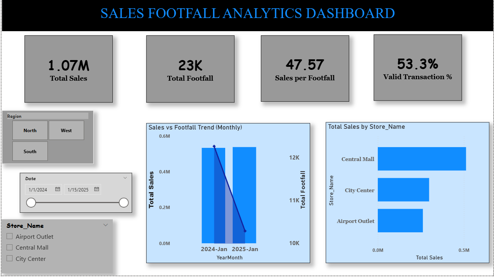

# Sales & Footfall Analytics Dashboard (Power BI)

This project analyzes store performance by combining **Sales**, **Footfall**, and **Store Master** data into a clean analytical model and Power BI dashboard.

📊 **Power BI Dashboard PDF:**  
You can download or view the full **Power BI report** here:  

## Files Included 
- `Sales_Data.csv` — transaction-level sales dataset  (datasets folder)
- `Footfall_Data.xlsx` — daily store-level footfall dataset  (datasets folder)
- `Store_Master.csv` — store metadata (store name + region)  (datasets folder)
- `Sales_Footfall_Analytics.pbix` — Power BI report file  (dashboard folder)
- `Pipeline_defining.pdf` — data audit notes (issues, assumptions, fixes, model design) (documentation folder)
-  `Implementation_pipeline.pdf` — data audit notes (issues, assumptions, fixes, model design) (documentation folder)

---

## Data Cleaning & Standardization (Power Query)
Key cleaning steps applied:
- Standardized `Store_ID` as **Text** across all datasets
- Fixed mixed date formats in Sales (`YYYY/MM/DD` and `DD-MM-YYYY`)
- Trimmed store names to remove whitespace inconsistencies
- Converted numeric columns to correct types (Sales_Amount, Footfall_Count)
- Flagged invalid sales records (missing or zero sales) for data quality tracking

---

## Data Model (Star Schema)
The report uses a star schema for clean and scalable analysis:

### Dimension Tables
- `DimDate` (calendar table for trends and YoY logic)
- `DimStore` (from Store_Master)

### Fact Tables
- `FactSales`
- `FactFootfall`

Relationships:
- `DimStore[Store_ID]` → `FactSales[Store_ID]`
- `DimStore[Store_ID]` → `FactFootfall[Store_ID]`
- `DimDate[Date]` → `FactSales[Date]`
- `DimDate[Date]` → `FactFootfall[Date]`

---

## Dashboard Pages
### 1) Executive Summary
- Total Sales, Total Footfall, Sales per Footfall
- Sales vs Footfall monthly trend
- Store-wise sales performance
- Slicers: Date, Region, Store

### 2) YoY Comparison
- Current Year vs Previous Year metrics
- YoY growth % for Sales and Footfall
- Trend comparison with last year

### 3) Data Quality
- Missing and zero sales record tracking
- Invalid transaction count by store
- Table view of invalid records for transparency

### 4) Key Insights

### 3) Future Recommendations 

---

## Notes
- Transaction_ID was not unique in the dataset, so it was treated as a reference field and not used as a primary key.
- Invalid sales records were flagged instead of being imputed, to avoid creating artificial revenue.

---

## How to Use
1. Clone the repo
2. Open the Dashoard folder
3. Sales-Footfall-Analytics-Dashboard-PowerBI.pbix (main dashboard file)
3. To Engage use slicers (Date / Region / Store) to explore performance

---

## Author
Joel Siby - joelag1235@gmail.com (in case you need to contact)
